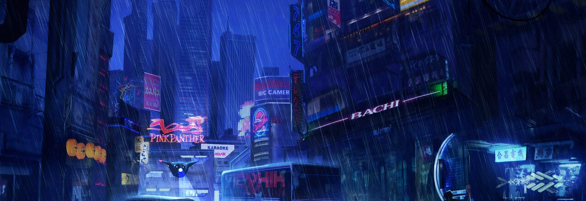

<div align="center">



```
 █████╗ ██████╗  ██████╗██╗  ██╗███╗   ██╗███████╗██╗  ██╗██╗   ██╗███████╗
██╔══██╗██╔══██╗██╔════╝██║  ██║████╗  ██║██╔════╝╚██╗██╔╝██║   ██║██╔════╝
███████║██████╔╝██║     ███████║██╔██╗ ██║█████╗   ╚███╔╝ ██║   ██║███████╗
██╔══██║██╔══██╗██║     ██╔══██║██║╚██╗██║██╔══╝   ██╔██╗ ██║   ██║╚════██║
██║  ██║██║  ██║╚██████╗██║  ██║██║ ╚████║███████╗██╔╝ ██╗╚██████╔╝███████║
╚═╝  ╚═╝╚═╝  ╚═╝ ╚═════╝╚═╝  ╚═╝╚═╝  ╚═══╝╚══════╝╚═╝  ╚═╝ ╚═════╝ ╚══════╝
                    ███████╗ ██████╗ ███████╗
                    ╚════██║██╔═████╗╚════██║
                        ██╔╝██║██╔██║    ██╔╝
                       ██╔╝ ████╔╝██║   ██╔╝
                       ██║  ╚██████╔╝   ██║
                       ╚═╝   ╚═════╝    ╚═╝
```

# `hyprforge`

### **Forged by [archnexus707](https://github.com/archnexus707) — for the rebels of the terminal**

*A dual desktop-ricing monorepo for Kali Linux. Hyprland on bare metal, i3wm+XFCE in VMs — same brand, one neon heartbeat.*

<br/>


<br/>

[**▸ Kali-Hyprland**](Kali-Hyprland/) &nbsp;·&nbsp; [**▸ D_WM-XFCE**](D_WM-XFCE/) &nbsp;·&nbsp; [**▸ Quick start**](#-quick-start) &nbsp;·&nbsp; [**▸ FAQ**](#-faq)

</div>

---

## ◆ Two stacks, one brand

```
   ┌───────────────────────────────┐    ┌──────────────────────────────┐
   │       Kali-Hyprland/          │    │        D_WM-XFCE/            │
   │  ──────────────────────────── │    │  ─────────────────────────── │
   │   Wayland · Hyprland          │    │   X11 · i3wm · picom         │
   │   bare-metal + real GPU       │    │   VMware / VirtualBox safe   │
   │   hyprlock · ags · blur       │    │   apt-installable · light    │
   │   built from source           │    │   6-phase modular installer  │
   └───────────────┬───────────────┘    └──────────────┬───────────────┘
                   │                                   │
                   └────────── shared brand ───────────┘
                                archnexus707
                              accent #00ff9c
                       cyberpunk neon · vim keybinds
                       interactive tours · diagnostics
```

Both stacks share neon `#00ff9c`, vim-style keybinds, Tokyo Night + Catppuccin palettes, and cyberpunk interactive welcome experiences. Muscle memory transfers — pick the stack that matches your hardware.

---

## ▸ Quick start

```bash
git clone https://github.com/archnexus707/hyprforge.git ~/hyprforge
cd ~/hyprforge

# ▸ Bare-metal Kali with a real GPU → Hyprland (Wayland)
cd Kali-Hyprland
./install.sh

# ▸ Kali in VMware / VirtualBox → i3wm + XFCE (X11)
cd ../D_WM-XFCE
./setup.sh          # quick dependency bootstrap (optional)
./install.sh        # full cyberpunk rice
./doctor.sh         # system diagnostic
./welcome.sh        # interactive tour
```

> **▲ heads-up** — Both installers are **idempotent** (safe to re-run). D_WM-XFCE adds an i3 session — XFCE stays untouched. Kali-Hyprland replaces session configs (see its README for recovery).

---

## ◆ Which stack?

| | **Kali-Hyprland/** | **D_WM-XFCE/** |
|---|---|---|
| **Target** | Bare-metal Kali + GPU | VMware / VirtualBox / KVM |
| **Display** | Wayland (Hyprland) | X11 (i3wm + picom) |
| **Aesthetic** | Blur, animations, hyprlock | Tokyo Night + picom blur + rofi + dunst |
| **GPU needed** | OpenGL ≥ 3.3 | None — works on `vmwgfx` |
| **Risk** | Replaces DM + session configs | Adds i3 session — XFCE untouched |
| **Recovery** | Pick another session at greeter | Pick *Xfce Session* at greeter |

> **Rule of thumb:** if `systemd-detect-virt` returns anything other than `none`, install **D_WM-XFCE**. It auto-detects VMware and switches to a safe xrender compositor backend.

---

## ▸ D_WM-XFCE

### Installation

```bash
cd D_WM-XFCE
./setup.sh       # quick apt bootstrap (optional — install.sh runs deps too)
./install.sh     # full 6-phase cyberpunk rice
./welcome.sh     # interactive neon tour (system scan, keybinds, tips)
```

### Interactive tools

| Command | What it does |
|---------|-------------|
| `./install.sh` | 6-phase modular installer — idempotent, safe to re-run |
| `./setup.sh` | Quick dependency bootstrapper — apt packages + i3 session entry |
| `./doctor.sh` | 40+ check diagnostic — packages, dotfiles, shell, themes, fonts, VMware |
| `./welcome.sh` | Post-install cyberpunk tour — system scan, rice integrity, keybind quick-ref, pro tips |
| `./spawn.sh` | Session launcher with neon boot sequence — starts picom, dunst, nm-applet, polkit |
| `./preset.sh` | Feature toggles — edit before install to skip phases |

### Keybinds

| Binding | Action |
|---------|--------|
| `SUPER+Enter` | Terminal (kitty) |
| `SUPER+r` / `SUPER+d` | App launcher (rofi) |
| `SUPER+Tab` | Window switcher |
| `SUPER+q` | Close window |
| `SUPER+f` | Fullscreen toggle |
| `SUPER+space` | Float toggle |
| `SUPER+1..0` | Switch workspace |
| `SUPER+Shift+1..0` | Move window to workspace |
| `SUPER+h/j/k/;` | Vim-style focus |
| `SUPER+Shift+h/j/k/l` | Vim-style move |
| `SUPER+Shift+q` | Logout menu (rofi) |
| `SUPER+Shift+c` | Reload i3 config |
| `SUPER+t` | Resize mode |
| `Print` | Screenshot area → clipboard |
| `SUPER+Print` | Screenshot (flameshot GUI) |

### What gets installed

| Layer | Components |
|-------|-----------|
| **WM** | i3-wm + i3status + i3lock |
| **Compositor** | picom (GLX bare metal / xrender VMware) |
| **Terminal** | kitty (Tokyo Night palette, 92% opacity) |
| **Shell** | zsh + oh-my-zsh + powerlevel10k + plugins |
| **Launcher** | rofi (cyberpunk themed, drun/window/run) |
| **Notifications** | dunst (3 urgency levels, neon frame) |
| **Theme** | Catppuccin-Mocha-Mauve GTK + Bibata-Modern-Ice cursor + Papirus icons |
| **CLI** | fastfetch · eza · bat · btop · maim · xclip · flameshot |
| **Wallpaper** | 1920×1080 cyberpunk PNG |

---

## ▸ Kali-Hyprland

### Installation

```bash
cd Kali-Hyprland
./install.sh                  # interactive phased installer
./update-hyprland.sh          # per-component rebuild (after git pull)
```

### Interactive tools

| Command | What it does |
|---------|-------------|
| `./install.sh` | Interactive installer — builds Hyprland + 60+ companions from source |
| `./install.sh --tty` | TTY mode — for remote/CI or terminals without whiptail |
| `./install.sh --preset preset.sh` | Non-interactive run from preset file |
| `./doctor.sh` | Post-install diagnostic — checks binaries, libs, configs, keybinds |
| `./update-hyprland.sh` | Rebuild Hyprland stack without full reinstall |
| `./update-hyprland.sh --dry-run` | Compile-only sanity check |
| `./update-hyprland.sh --fetch-latest` | Refresh version tags to latest, then build |
| `./dry-run-build.sh` | CI compile-only runner — tests all builds without installing |
| `./recovery.sh` | TTY2 rescue menu — restore session when Hyprland won't start |
| `./uninstall.sh` | Full removal — packages, configs, source dirs |
| `./preset.sh` | Feature selection — GTK themes, NVIDIA, SDDM, dotfiles, bluetooth |
| `./hypr-tags.env` | Version pins — edit to lock specific Hypr* package versions |

### Keybinds

| Binding | Action |
|---------|--------|
| `SUPER+Return` | Terminal (kitty) |
| `SUPER+D` | App launcher (rofi) |
| `SUPER+Q` | Close window |
| `SUPER+F` | Fullscreen |
| `SUPER+Space` | Float toggle |
| `SUPER+1..0` | Switch workspace |
| `SUPER+Shift+1..0` | Move to workspace |
| `SUPER+H/J/K/L` | Vim focus |
| `SUPER+Shift+H/J/K/L` | Vim move |
| `SUPER+H` or `SUPER+/` | Live keybind cheatsheet |
| `SUPER+X` | Power menu (rofi) |
| `SUPER+A` | Audio sink/source picker |
| `SUPER+W` | WiFi picker |
| `SUPER+Shift+B` | Bluetooth picker |
| `SUPER+V` | Clipboard history |
| `SUPER+N` | Notification history |
| `SUPER+F8` | Nightlight toggle |
| `SUPER+Shift+S` | OCR (region) |
| `Print` | Full screenshot |
| `SUPER+Print` | Region screenshot |
| `SUPER+Shift+Print` | Window screenshot |
| `SUPER+Shift+R` | Screen record toggle |

### More details

See [`Kali-Hyprland/README.md`](Kali-Hyprland/README.md) for full documentation and [`KALI-CHANGES.md`](Kali-Hyprland/KALI-CHANGES.md) for the fork delta from upstream.

---

## ◆ Installing both environments

You can install **both** stacks on the same Kali machine. D_WM-XFCE just adds a session entry — it never conflicts with Hyprland. Switch between them at the greeter:

```bash
cd ~/hyprforge

# Install XFCE+i3 side (safe, non-destructive)
cd D_WM-XFCE && ./setup.sh && ./install.sh

# Install Hyprland side
cd ../Kali-Hyprland && ./install.sh

# Post-install health checks
cd ../D_WM-XFCE && ./doctor.sh
cd ../Kali-Hyprland && ./doctor.sh
```

At login, pick:
- **i3 Cyberpunk** → D_WM-XFCE (X11, VM-safe)
- **Hyprland** → Kali-Hyprland (Wayland, GPU-accelerated)
- **Xfce Session** → stock XFCE (always available as fallback)

---

## ▸ FAQ

<details>
<summary><b>◇ How do I update?</b></summary>

```bash
cd ~/hyprforge && git pull

# D_WM-XFCE: re-run installer (idempotent)
cd D_WM-XFCE && ./install.sh

# Kali-Hyprland: per-component rebuild
cd ../Kali-Hyprland && ./update-hyprland.sh
```

</details>

<details>
<summary><b>◇ Can I customise keybinds?</b></summary>

**D_WM-XFCE:** Edit `~/.config/i3/config`. Re-run install with `dotfiles="OFF"` in `preset.sh` to skip config overwrite.

**Kali-Hyprland:** Write binds to `~/.config/hypr/UserConfigs/UserKeybinds.conf`.

</details>

<details>
<summary><b>◇ What if picom doesn't start / black screen in i3?</b></summary>

Check VMware: `systemd-detect-virt`. If in VMware, run `./install-scripts/02-picom.sh` to redeploy the xrender config. Verify: `command -v picom`.

</details>

<details>
<summary><b>◇ Something broke — how do I check?</b></summary>

```bash
# Full diagnostic for either stack
cd D_WM-XFCE && ./doctor.sh      # 21 checks
cd ../Kali-Hyprland && ./doctor.sh
```

</details>

---

## ◆ Gallery

<div align="center">

<table>
<tr>
<td align="center" width="50%">
<br/>
<b>▸ Kali-Hyprland</b><br/>
<sub>Wayland · Hyprland · blur · hyprlock</sub>
</td>
<td align="center" width="50%">
<br/>
<b>▸ D_WM-XFCE</b><br/>
<sub>X11 · i3wm · picom · VM-safe</sub>
</td>
</tr>
</table>

<sub>Both stacks ship a <b>194-wallpaper anime + cyberpunk pack</b> (downloaded on install) and a random-Pokémon fastfetch greeter on every terminal.</sub>

</div>

---

## ☕ Support

If hyprforge made your desktop glow:

[](mailto:archnexus707@gmail.com)

---

## ◆ Special thanks

**archnexus707** — forged the Kali-Hyprland stack.

Hyprland: [hyprwm](https://github.com/hyprwm). Themes: [Tokyo Night](https://github.com/folke/tokyonight.nvim), [Catppuccin](https://github.com/catppuccin).

---

<div align="center">

`forged by archnexus707 · for the rebels of the terminal`

**◆ ◆ ◆**

[**▸ Star**](https://github.com/archnexus707/hyprforge/stargazers) &nbsp;·&nbsp; [**▸ Fork**](https://github.com/archnexus707/hyprforge/fork) &nbsp;·&nbsp; [**▸ Issues**](https://github.com/archnexus707/hyprforge/issues)

**GPL-3.0** · See `Kali-Hyprland/LICENSE.md`

</div>
